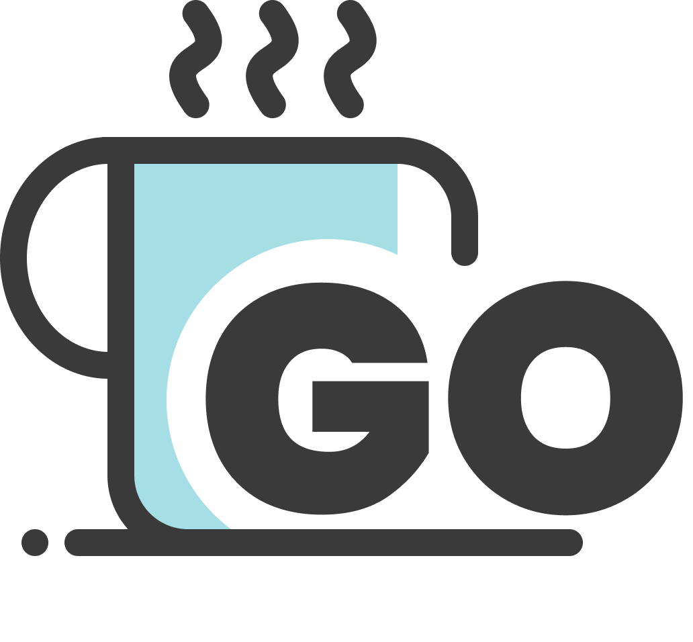

<!-- Improved compatibility of back to top link: See: https://github.com/othneildrew/Best-README-Template/pull/73 -->
<a name="readme-top"></a>
<!--
*** Thanks for checking out the Best-README-Template. If you have a suggestion
*** that would make this better, please fork the repo and create a pull request
*** or simply open an issue with the tag "enhancement".
*** Don't forget to give the project a star!
*** Thanks again! Now go create something AMAZING! :D
-->

<!-- PROJECT SHIELDS -->
<!--
*** I'm using markdown "reference style" links for readability.
*** Reference links are enclosed in brackets [ ] instead of parentheses ( ).
*** See the bottom of this document for the declaration of the reference variables
*** for contributors-url, forks-url, etc. This is an optional, concise syntax you may use.
*** https://www.markdownguide.org/basic-syntax/#reference-style-links
-->
[![Contributors][contributors-shield]][contributors-url]
[![Forks][forks-shield]][forks-url]
[![Stargazers][stars-shield]][stars-url]
[![Issues][issues-shield]][issues-url]
[![MIT License][license-shield]][license-url]
[![LinkedIn][linkedin-shield]][linkedin-url]

<!-- PROJECT LOGO -->
<br />
<div align="center">
  <a href="https://github.com/dongdong867/go-cafe">
    
  </a>

<h3 align="center">Go Cafe</h3>

  <p align="center">
    project_description
    <br />
    <a href="https://github.com/dongdong867/go-cafe"><strong>Explore the docs »</strong></a>
    <br />
    <br />
    <a href="https://github.com/dongdong867/go-cafe">View Demo</a>
    ·
    <a href="https://github.com/dongdong867/go-cafe/issues">Report Bug</a>
    ·
    <a href="https://github.com/dongdong867/go-cafe/issues">Request Feature</a>
  </p>
</div>

<!-- TABLE OF CONTENTS -->
<details>
  <summary>Table of Contents</summary>
  <ol>
    <li>
      <a href="#about-the-project">About The Project</a>
      <ul>
        <li><a href="#built-with">Built With</a></li>
      </ul>
    </li>
    <li>
      <a href="#getting-started">Getting Started</a>
      <ul>
        <li><a href="#prerequisites">Prerequisites</a></li>
        <li><a href="#installation">Installation</a></li>
      </ul>
    </li>
    <li><a href="#usage">Usage</a></li>
    <li><a href="#roadmap">Roadmap</a></li>
    <li><a href="#contributing">Contributing</a></li>
    <li><a href="#license">License</a></li>
    <li><a href="#contact">Contact</a></li>
    <li><a href="#acknowledgments">Acknowledgments</a></li>
  </ol>
</details>

<!-- ABOUT THE PROJECT -->
## About The Project

[![Product Name Screen Shot][product-screenshot]](https://example.com)

Here's a blank template to get started: To avoid retyping too much info. Do a search and replace with your text editor for the following: `dongdong867`, `go-cafe`, `twitter_handle`, `linkedin_username`, `email_client`, `dongdong0867@gmail.com`, `Go Cafe`, `project_description`

<p align="right">(<a href="#readme-top">back to top</a>)</p>

### Built With

* [![Next][Next.js]][Next-url]
* [![React][React.js]][React-url]
* [![Tailwind][TailwindCSS]][Tailwind-url]
* [![DaisyUI][DaisyUI]][Daisy-url]
* [![GraphQL][GraphQL]][GraphQL-url]
* [![Apollo][Apollo]][Apollo-url]
* [![Nest][Nest.js]][Nest-url]
* [![Typescript][Typescript]][Typescript-url]
* [![Prisma][Prisma]][Prisma-url]
* [![MySQL][MySQL]][MySQL-url]
* [![Firebase][Firebase]][Firebase-url]
* [![GoogleCloud][GoogleCloud]][GoogleCloud-url]
* [![JWT][JWT]][JWT-url]
* [![Vercel][Vercel]][Vercel-url]
* [![PWA][PWA]][PWA-url]

<p align="right">(<a href="#readme-top">back to top</a>)</p>

<!-- GETTING STARTED -->
## Getting Started

This is an example of how you may give instructions on setting up your project locally.
To get a local copy up and running follow these simple example steps.

### Prerequisites

This is an example of how to list things you need to use the software and how to install them.

* npm

  ```sh
  npm install npm@latest -g
  ```

### Installation

1. Get a free API Key at [https://example.com](https://example.com)
2. Clone the repo

   ```sh
   git clone https://github.com/dongdong867/go-cafe.git
   ```

3. Install NPM packages

   ```sh
   npm install
   ```

4. Enter your API in `config.js`

   ```js
   const API_KEY = 'ENTER YOUR API';
   ```

<p align="right">(<a href="#readme-top">back to top</a>)</p>

<!-- USAGE EXAMPLES -->
## Usage

Use this space to show useful examples of how a project can be used. Additional screenshots, code examples and demos work well in this space. You may also link to more resources.

_For more examples, please refer to the [Documentation](https://example.com)_

<p align="right">(<a href="#readme-top">back to top</a>)</p>

<!-- ROADMAP -->
## Roadmap

* [ ] Feature 1
* [ ] Feature 2
* [ ] Feature 3
  * [ ] Nested Feature

See the [open issues](https://github.com/dongdong867/go-cafe/issues) for a full list of proposed features (and known issues).

<p align="right">(<a href="#readme-top">back to top</a>)</p>

<!-- CONTRIBUTING -->
## Contributing

Contributions are what make the open source community such an amazing place to learn, inspire, and create. Any contributions you make are **greatly appreciated**.

If you have a suggestion that would make this better, please fork the repo and create a pull request. You can also simply open an issue with the tag "enhancement".
Don't forget to give the project a star! Thanks again!

1. Fork the Project
2. Create your Feature Branch (`git checkout -b feature/AmazingFeature`)
3. Commit your Changes (`git commit -m 'Add some AmazingFeature'`)
4. Push to the Branch (`git push origin feature/AmazingFeature`)
5. Open a Pull Request

<p align="right">(<a href="#readme-top">back to top</a>)</p>

<!-- LICENSE -->
## License

Distributed under the MIT License. See `LICENSE.txt` for more information.

<p align="right">(<a href="#readme-top">back to top</a>)</p>

<!-- CONTACT -->
## Contact

Your Name - [@twitter_handle](https://twitter.com/twitter_handle) - <<<dongdong0867@gmail.com>@email_client.com>>

Project Link: [https://github.com/dongdong867/go-cafe](https://github.com/dongdong867/go-cafe)

<p align="right">(<a href="#readme-top">back to top</a>)</p>

<!-- ACKNOWLEDGMENTS -->
## Acknowledgments

* []()
* []()
* []()

<p align="right">(<a href="#readme-top">back to top</a>)</p>

<!-- MARKDOWN LINKS & IMAGES -->
<!-- https://www.markdownguide.org/basic-syntax/#reference-style-links -->
[contributors-shield]: https://img.shields.io/github/contributors/dongdong867/go-cafe.svg?style=for-the-badge
[contributors-url]: https://github.com/dongdong867/go-cafe/graphs/contributors
[forks-shield]: https://img.shields.io/github/forks/dongdong867/go-cafe.svg?style=for-the-badge
[forks-url]: https://github.com/dongdong867/go-cafe/network/members
[stars-shield]: https://img.shields.io/github/stars/dongdong867/go-cafe.svg?style=for-the-badge
[stars-url]: https://github.com/dongdong867/go-cafe/stargazers
[issues-shield]: https://img.shields.io/github/issues/dongdong867/go-cafe.svg?style=for-the-badge
[issues-url]: https://github.com/dongdong867/go-cafe/issues
[license-shield]: https://img.shields.io/github/license/dongdong867/go-cafe.svg?style=for-the-badge
[license-url]: https://github.com/dongdong867/go-cafe/blob/master/LICENSE.txt
[linkedin-shield]: https://img.shields.io/badge/-LinkedIn-black.svg?style=for-the-badge&logo=linkedin&colorB=555
[linkedin-url]: https://linkedin.com/in/linkedin_username
[product-screenshot]: images/screenshot.png
[Next.js]: https://img.shields.io/badge/next.js-000000?style=for-the-badge&logo=nextdotjs&logoColor=white
[Next-url]: https://nextjs.org/
[React.js]: https://img.shields.io/badge/ReactJS-20232A?style=for-the-badge&logo=react&logoColor=61DAFB
[React-url]: https://reactjs.org/
[TailwindCSS]:https://img.shields.io/badge/Tailwind_CSS-38B2AC?style=for-the-badge&logo=tailwind-css&logoColor=white
[Tailwind-url]: https://tailwindcss.com
[DaisyUI]: https://img.shields.io/badge/DaisyUI-4f14ee?style=for-the-badge&logo=daisyui&logoColor=white
[Daisy-url]: https://daisyui.com
[GraphQL]: https://img.shields.io/badge/GraphQL-e10098?style=for-the-badge&logo=graphql&logoColor=white
[GraphQL-url]: https://graphql.org
[Apollo]: https://img.shields.io/badge/Apollo-1c223e?style=for-the-badge&logo=apollographql&logoColor=white
[Apollo-url]: https://apollographql.com
[Nest.js]: https://img.shields.io/badge/Nest.js-DD0031?style=for-the-badge&logo=nestjs&logoColor=white
[Nest-url]: https://nestjs.com
[Typescript]: https://img.shields.io/badge/TypeScript-007ACC?style=for-the-badge&logo=typescript&logoColor=white
[Typescript-url]: https://www.typescriptlang.org
[Prisma]: https://img.shields.io/badge/Prisma-1b202b?style=for-the-badge&logo=Prisma&logoColor=white
[Prisma-url]: https://prisma.io
[MySQL]: https://img.shields.io/badge/MySQL-32738c?style=for-the-badge&logo=mysql&logoColor=white
[MySQL-url]: https://mysql.com
[Firebase]: https://img.shields.io/badge/Firebase-e3a71e?style=for-the-badge&logo=Firebase&logoColor=white
[Firebase-url]: https://firebase.com
[GoogleCloud]: https://img.shields.io/badge/Google_Cloud-4285F4?style=for-the-badge&logo=google-cloud&logoColor=white
[GoogleCloud-url]: https://cloud.google.com
[JWT]: https://img.shields.io/badge/JWT-000000?style=for-the-badge&logo=json-web-tokens&logoColor=pink
[JWT-url]: https://jwt.io
[Vercel]:https://img.shields.io/badge/Vercel-000000?style=for-the-badge&logo=vercel&logoColor=white
[Vercel-url]: https://vercel.com
[PWA]: https://img.shields.io/badge/PWA-000000?style=for-the-badge&logo=pwa&logoColor=white
[PWA-url]: https://web.dev/progressive-web-apps/
